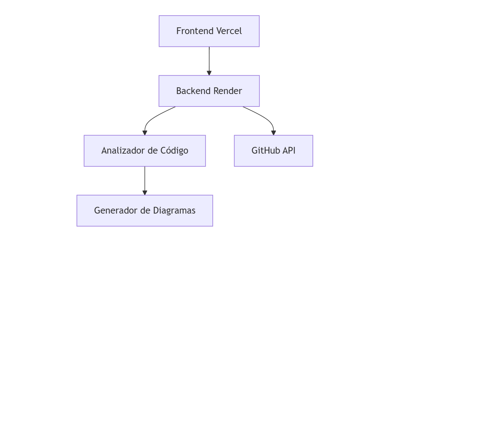

# 🚀 Code2Diagram

**Visualiza la arquitectura de tu código automáticamente**

## ✨ ¿Para qué sirve?

Code2Diagram es una herramienta que **analiza tu código fuente y genera diagramas de arquitectura automáticamente**. Convierte código complejo en visualizaciones claras que te ayudan a:

- 🔍 **Entender proyectos legacy** rápidamente
- 📊 **Visualizar dependencias** entre módulos
- 🎯 **Identificar problemas** de arquitectura
- 🚀 **Onboarding rápido** en nuevos proyectos

## 🛠️ ¿Cómo funciona?

1. **Ingresa tu código** (editor, GitHub o archivo)
2. **Analiza automáticamente** clases, métodos y dependencias  
3. **Genera diagramas** interactivos de la arquitectura
4. **Recibe recomendaciones** para mejorar tu código

## 🌟 Características principales

- **⚡ Análisis en tiempo real** - Resultados instantáneos
- **📁 Multi-fuente** - Editor, GitHub o upload de archivos
- **🎨 Diagramas interactivos** - Visualiza relaciones entre componentes
- **🔍 Detección de issues** - Identifica problemas potenciales
- **💡 Recomendaciones inteligentes** - Mejoras basadas en best practices

## 🚀 Despliegue en Vivo

### Opción 1: 🎯 Usar la Versión en Vivo
La aplicación está desplegada y funcionando:
- **Frontend**: [https://code-2-diagram.vercel.app](https://code-2-diagram.vercel.app)
- **Backend**: [https://code-2-diagram.onrender.com](https://code-2-diagram.onrender.com)

🚀 Quick Start
bash
# Backend
cd backend
npm install
npm run dev

# Frontend  
cd frontend
python -m http.server 8000
Abre: http://localhost:8000

 📦 Tech Stack
Frontend: HTML5, CSS3, JavaScript (ES6+)

Backend: Node.js, Express.js

Análisis: BabelParser, AST Analysis

Diagramas: Mermaid.js

API: GitHub REST API

🎯 Open Source
¡Este proyecto es 100% Open Source! 🎉

✅ Código abierto - MIT License

✅ Contribuciones welcome - PRs son bienvenidas

✅ Transparente - Sin tracking ni data collection

✅ Comunidad - Hecho por devs para devs

🤝 ¿Quieres contribuir?
¡Las contribuciones son bienvenidas! Este proyecto es completamente open source y se mantiene por la comunidad.

Roadmap:

Soporte para más lenguajes (Python, Java, Go)

Análisis de calidad de código (linting)

Exportación de diagramas (PNG, SVG)

Plugin para IDEs (VSCode, WebStorm)

📄 Licencia
MIT License - ¡Usa este código libremente en tus proyectos!

¿Te ayudó esta herramienta? ¡Dale una ⭐ en GitHub!

Hecho con ❤️ para la comunidad de desarrolladores

